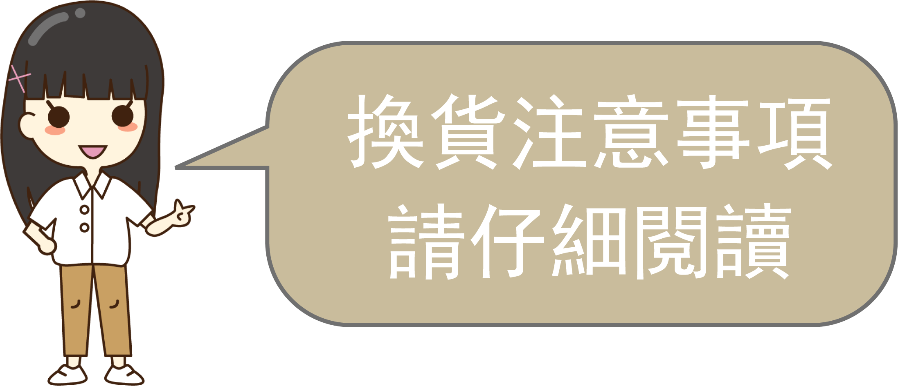

由於退貨會造成消費者與我們金錢與時間的損耗，為了避免爭議、確保雙方權益，特別在此說明我們規定的退、換貨狀況與條件，並列舉相關的法律規定內容，以提供給本網站消費者參考與配合。

若有疑義，請盡量於交易前聯繫我們洽詢，避免雙方無謂的爭執與損耗，非常謝謝大家的諒解。

## 退、換貨狀況與條件

凡是向我們購買的商品，只要符合特定條件，我們將允許消費者進行退換貨。而一般退、換貨可分為下列三種狀況，我們設定有相關條件，請詳加閱讀並且配合。

### 收到商品但是後悔購買，要求退貨

在網站上購買商品，按 [『消費者保護法』第 19 條「通訊交易」](https://law.moj.gov.tw/LawClass/LawSingle.aspx?Pcode=J0170001&FLNO=19) 規範，享有七天猶豫期無條件退貨。但是因為本網站所銷售商品具備些許特殊性質，特別附加如下條件：

- 代購商品除外條款：

    凡購買非現貨商品（即需要特別為您進口，並無法於訂單成立三日內交付者），符合 「通訊交易解除權合理例外情事適用準則」第二條第 2 項客製化給付的例外條款 。故除本網站特別通融者，一律不得退貨。

- 退貨商品必須回復原狀：

    退貨是要求解除契約之行為，按 [『民法』第 29 條「契約解除時，當事人雙方回復原狀之義務」](https://law.moj.gov.tw/LawClass/LawSingle.aspx?Pcode=B0000001&FLNO=259) 及 [「通訊交易解除權合理例外情事適用準則」第二條第一項第二款客製化給付](https://law.moj.gov.tw/LawClass/LawSingle.aspx?pcode=J0170012&flno=2)，請您務必保持商品內容物及外包裝之完整。即便僅是拆封外包裝，本網站亦有向您索取部分或全部費用的權利。故若有疑慮時，可電洽諮詢「行政院消費者保護會-1950」。

- 退貨費用由消費者負擔：

  因為我司產品盡皆為專業人士或業餘愛好者進行科學或工程研究所需之零組件或工具，無法僅憑實體商品之外觀及陳列與否，即可判定是否適用於您的需求，必須詳細閱讀規格、使用說明、並且搭配附屬之原始碼開發，方得進行實際應用，而相關規格、使用說明、與原始碼，事先皆可透過網路自由地取得並詳加審閱，與消費者保護法為考量通訊交易特性致使無法審閱商品實體的立法前提不盡相同。
  
  故若是您收到商品後，實際應用才發現因為不符需求而要求退貨。我司為考量作業成本，因退貨所產生之運送費用必須由您自行承擔。也希望透過這個小小的成本要求，讓您在事前能更謹慎評估商品的特性與規格，再加以購買，敬請見諒。

### 瑕疵品退換
